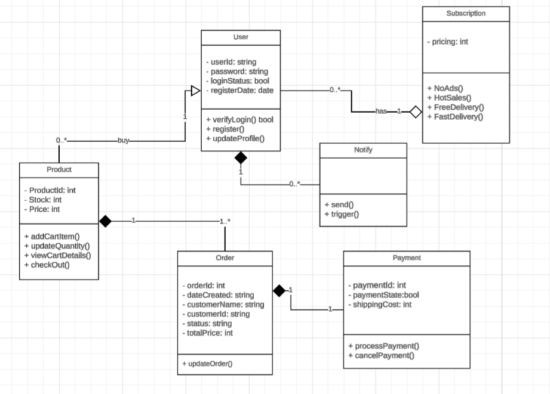

## Diagrama UML
Realice un Diagrama de Clases UML mostrando al menos 4 clases relevantes 
(ej. Producto, Usuario, Notificador, Suscripción).

## Estrategia de problema

Describa  brevemente  qué  estrategia  usaría  para  enviar  10.000  correos 
simultáneos sin bloquear la aplicación

Para enviar 10.000 correos simultáneos sin bloquear la aplicación, se podría 
utilizar una combinación de colas de mensajes y procesamiento asíncrono. Ya que la colas nos ayuda a ya establcer una estrucura de datas tipo FIFO (First In First Out) y la asincronia nos permite enviar correos sin esperar a que cada uno se complete antes de iniciar el siguiente. Es importante tener en cuenta la base de datos ya que hay que ver como estan las conexiones en telecomunicaciones y si es necesario implementar un sistema de reintentos para los correos que no se envían correctamente en el primer intento. 